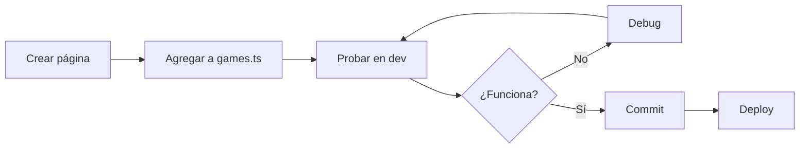
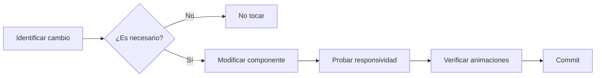

# FullStack: Home Page Retro Arcade - Guía de Implementación

**Proyecto:** Metro Minute  
**Fecha:** 2026-03-26  
**Estado:** ✅ YA IMPLEMENTADO  
**Prioridad:** BAJA (mantenimiento)

---

## ⚡ TL;DR

**La home page YA ESTÁ LISTA Y FUNCIONANDO.** No requiere implementación adicional.

Solo necesitas saber:
1. **Dónde está:** `src/app/page.tsx`
2. **Cómo agregar juegos:** Editar `src/lib/games.ts`
3. **Dónde están los componentes:** `src/components/home/`

---

## 📋 Checklist de Verificación

Antes de considerar la tarea completa, verifica:

```bash
# 1. Levantar el servidor
npm run dev

# 2. Abrir en navegador
# http://localhost:3000

# 3. Verificar visualmente:
# ✅ Fondo negro con efectos retro
# ✅ Título "METRO MINUTE" con font arcade
# ✅ Card de "Bubble" visible
# ✅ Hover en card muestra glow neón cyan
# ✅ Click en "PLAY" navega a /bubble
# ✅ Header sticky funciona
# ✅ Responsive en mobile
```

---

## 🎮 Cómo Agregar un Nuevo Juego

### Paso a Paso

**1. Crear la página del juego**

```bash
# Crear archivo
touch src/app/mi-nuevo-juego/page.tsx
```

```typescript
// src/app/mi-nuevo-juego/page.tsx
export default function MiNuevoJuegoPage() {
  return (
    <main className="min-h-screen bg-retro-dark">
      <h1>Mi Nuevo Juego</h1>
      {/* Tu código aquí */}
    </main>
  );
}
```

**2. Agregar al catálogo**

```typescript
// src/lib/games.ts

export const GAMES: Game[] = [
  {
    id: 'bubble',
    title: 'Bubble',
    icon: '🎯',
    description: 'Test your reflexes! Click the targets before time runs out.',
    href: '/bubble',
    available: true,
    accentColor: 'var(--neon-cyan)',
    tags: ['reflex', 'casual'],
  },
  // 👇 AGREGAR AQUÍ
  {
    id: 'mi-nuevo-juego',
    title: 'Mi Nuevo Juego',
    icon: '🎮', // Emoji o importar de lucide-react
    description: 'Descripción corta y atractiva del juego.',
    href: '/mi-nuevo-juego',
    available: true, // Cambiar a false si es "coming soon"
    accentColor: 'var(--neon-magenta)', // cyan, magenta, yellow, green
    tags: ['action', 'multiplayer'],
  },
];
```

**3. Verificar**

```bash
# Recargar la página
# La card aparecerá automáticamente en la home
```

---

## 🎨 Sistema de Colores Neón

Usa estas variables CSS para mantener consistencia:

```css
var(--neon-cyan)    /* #00fff7 - Default, usar para juegos principales */
var(--neon-magenta) /* #ff00ff - Para juegos de acción */
var(--neon-yellow)  /* #ffff00 - Para puzzles */
var(--neon-green)   /* #39ff14 - Para juegos de score */
```

**Ejemplo:**

```typescript
accentColor: 'var(--neon-magenta)', // ✅ Correcto
accentColor: '#ff00ff',              // ❌ Evitar hardcodear
```

---

## 📁 Estructura de Archivos (Referencia Rápida)

```
src/
├── app/
│   ├── page.tsx              ← HOME PAGE (ya existe)
│   ├── layout.tsx            ← Layout raíz
│   ├── globals.css           ← Estilos retro
│   └── bubble/page.tsx       ← Juego Bubble (ya existe)
│
├── components/home/
│   ├── Header.tsx            ← Navegación
│   ├── Footer.tsx            ← Pie de página
│   ├── GamesGrid.tsx         ← Grid de juegos
│   ├── GameCard.tsx          ← Card individual
│   └── RetroBackground.tsx   ← Fondo animado
│
├── lib/
│   └── games.ts              ← CATÁLOGO DE JUEGOS (editar aquí)
│
└── types/
    └── game.ts               ← Interfaz Game
```

---

## 🔧 Contrato de Interfaz `Game`

```typescript
interface Game {
  id: string;                    // 'bubble', 'puzzle', etc.
  title: string;                 // 'Bubble', 'Puzzle Mania'
  icon: string | React.ComponentType<{ className?: string }>;
  description: string;           // Max ~80 caracteres
  href: string;                  // '/bubble', '/puzzle'
  available: boolean;            // true = jugable, false = coming soon
  accentColor?: string;          // 'var(--neon-cyan)'
  tags?: string[];               // ['reflex', 'casual']
}
```

**Ejemplo completo:**

```typescript
{
  id: 'space-invaders',
  title: 'Space Invaders',
  icon: '👾',
  description: 'Classic arcade action. Defend Earth from alien invasion!',
  href: '/space-invaders',
  available: true,
  accentColor: 'var(--neon-green)',
  tags: ['arcade', 'shooter', 'classic'],
}
```

---

## 🚀 Comandos Útiles

```bash
# Desarrollo
npm run dev          # Servidor en localhost:3000

# Build producción
npm run build        # Compilar para producción
npm run start        # Servidor producción local

# Linting
npm run lint         # Verificar código

# Testing manual
# 1. Abrir http://localhost:3000
# 2. Verificar home carga
# 3. Click en Bubble → debe navegar a /bubble
# 4. Probar en mobile (DevTools)
```

---

## ⚠️ Cosas a Evitar

### ❌ NO Hacer

1. **No modificar componentes home sin necesidad**
   - Ya están funcionando
   - Solo editar si hay bugs

2. **No hardcodear colores**
   ```typescript
   // ❌ Mal
   accentColor: '#00fff7'
   
   // ✅ Bien
   accentColor: 'var(--neon-cyan)'
   ```

3. **No crear nuevas rutas manuales**
   - El sistema es automático
   - Solo agregar a `GAMES` array

4. **No cambiar fuentes sin consultar**
   - Press Start 2P y VT323 son parte del diseño retro

### ✅ Sí Hacer

1. **Mantener consistencia de tags**
   ```typescript
   tags: ['reflex', 'casual', 'action', 'puzzle', 'multiplayer']
   ```

2. **Usar iconos consistentes**
   - Emojis para prototipos rápidos
   - Lucide React para producción

3. **Mantener descripciones cortas**
   - Max 80 caracteres
   - Claras y atractivas

---

## 📊 Flujo de Trabajo Recomendado

### Para Agregar Nuevo Juego



### Para Modificar Home



---

## 🐛 Troubleshooting

### Problema: La card no aparece

**Solución:**
1. Verificar que agregaste el juego a `GAMES` array
2. Verificar que `available: true`
3. Recargar la página (hard refresh: Cmd+Shift+R)

### Problema: El hover no funciona

**Solución:**
1. Verificar que `available: true`
2. Verificar que Tailwind está compilando
3. Revisar consola del navegador

### Problema: Animaciones lentas

**Solución:**
1. Verificar que no hay errores en consola
2. Verificar que Framer Motion está instalado
3. Probar en modo incógnito (puede ser extensión del navegador)

---

## 📞 Contacto

**Dudas sobre arquitectura:** Revisar `docs/arch-home-retro-arcade.md`  
**Bugs en home:** Crear issue en GitHub  
**Nuevas features:** Consultar con Arquitecto primero

---

## ✅ Definition of Done

La home page se considera completa cuando:

- [x] Home carga sin errores en `/`
- [x] Estilo retro arcade aplicado
- [x] Card de Bubble visible y navegable
- [x] Responsive en mobile/tablet/desktop
- [x] Animaciones funcionando
- [x] Header sticky funcional
- [x] Footer visible
- [x] Performance aceptable (<2s carga)

---

**Documento para:** FullStack Team  
**Creado por:** Arquitecto  
**Fecha:** 2026-03-26

**ESTADO: ✅ IMPLEMENTADO Y FUNCIONAL**
